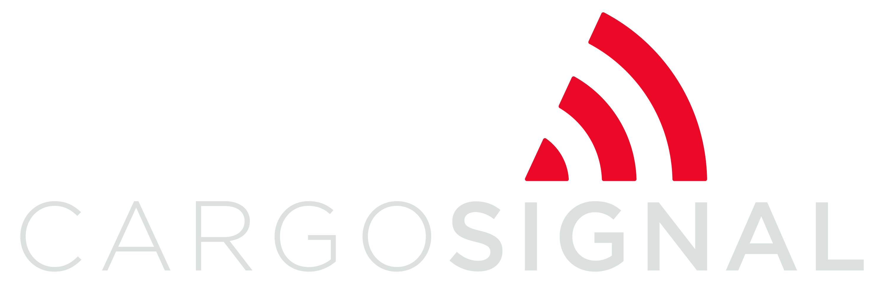
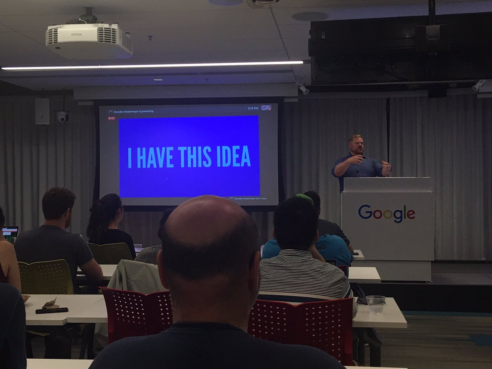
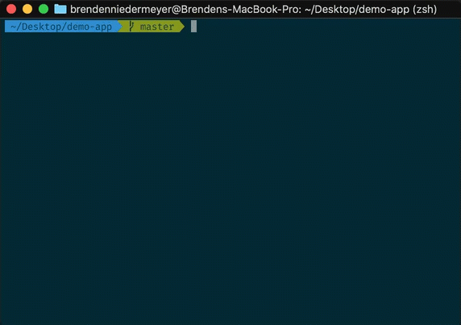
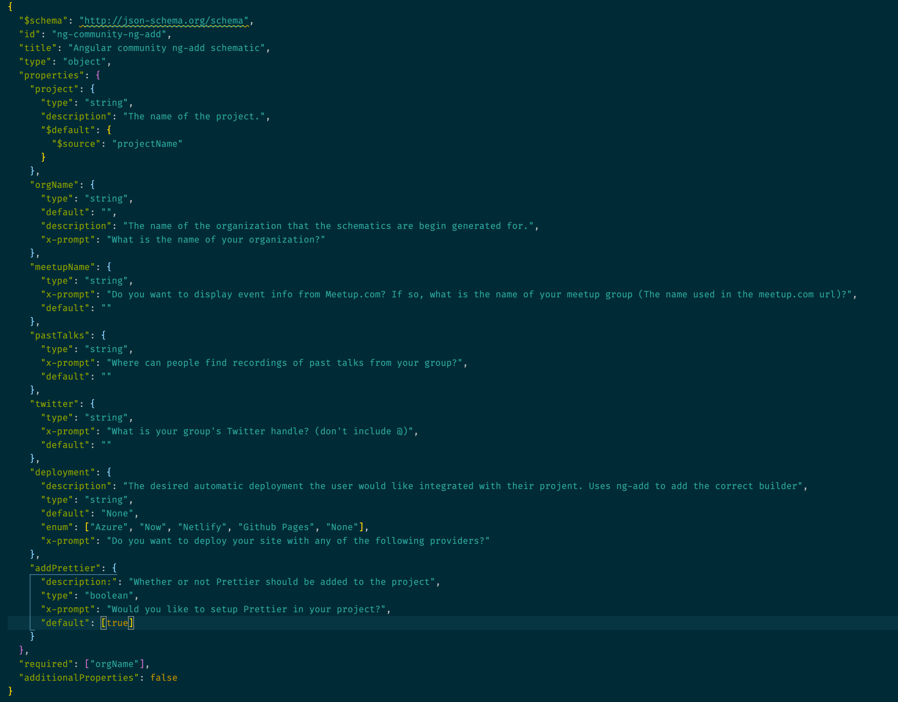

footer: January 2020| Brenden Niedermeyer

# Introducing

## Community Schematics


[.hide-footer]

---


# Brenden Niedermeyer


## 

---

[.hide-footer]


---



---


---

# Community Schematics

A set of `ng add` schematics to help quickly bootstrap websites for community groups and give them a good starting point for building their home on the web.

---

## What's a schematic?

---

## What's a schematic?

> A schematic is a template-based code generator that supports complex logic. It is a set of instructions for transforming a software project by generating or modifying code. Schematics are packaged into collections and installed with npm.
> --https://angular.io/guide/schematics

---



---

# Motivation

- Help other groups in and outside of the Angular community
- Fun way to teach schematics with a project

---


<br>
<sub>https://www.theverge.com/2019/10/15/20893343/meetup-users-furious-new-rsvp-payment-test</sub>

---

If something happened to Meetup, what would we do?

---

# Features

[.column]

- :white_check_mark: Generates a starter website, built with Angular 8, for your group
- :white_check_mark: Uses Angular Material
- :white_check_mark: Allows links to video hosting services and twitter

[.column]

- :white_check_mark: Displays events from your groups Meetup.com page
- :white_check_mark: `ng deploy` support to deploy your site to Azure, Now, Netlify, or Github Pages
- :white_check_mark: Prettier integration

---

[.hide-footer]  


---

# Planned Features

- Easy (and private) contact sharing to help network with people you meet at group events
- PWA and Angular Universal support
- Self hosted blogs for groups
- Calendar management without Meetup.com
- Email list support

---

# Demo

---

# A Peek Behind the Curtain

---

# Terms

- Tree: Virtural representation of filesystem. Contains a base of existing files and a staging area for updates.
- SchematicContext: The context the schematic runs in. Supplies helpful metadata utils and things like logging.
- Rule: Object that defines a function that takes a `Tree` and `SchemtaicContext`, applies changes, and returns a new Tree.

---

```bash
$ npm install -g @angular-devkit/schematics-cli

$ schematics blank --name=hello-world
```

---

Rules Factory

```typescript
/**
 * Entry point for the schematic
 * @param options The options that the user declared
 */
export default function(options: Schema): Rule {
  return (tree: Tree, context: SchematicContext) => {
    context.logger.info('Setting up project!');
    return chain([prepareDependencies(options), setupProject(options)]);
  };
}
```

---

Calling other schematics in the same project

```typescript
/**
 * Calls the internal meetup schematic with the meetup name provided by the user
 * @param options The options that the user declared
 */
function addMeetup(options: Schema): Rule {
  const meetupName = options.meetupName;

  return (_: Tree, context: SchematicContext) => {
    return schematic('meetup', { meetupName });
  };
}
```

---

Calling External Schematics

```typescript
/**
 * A Rule factory that adds Angular Material to the project
 * @param options The options that the user declared
 */
function addMaterial(options: Schema): Rule {
  return (_tree: Tree, _context: SchematicContext) => {
    return externalSchematic('@angular/material', 'install', {
      options
    });
  };
}
```

---

[.hide-footer]



---

# Resources

[.column]

- Repo: https://github.com/angular-seattle/community-schematics
- Slides: https://github.com/bniedermeyer/community-schematics-ng-seattle
- https://angular.io/guide/schematics-authoring
- https://brianflove.com/2018/12/15/ng-add-schematic/
- https://www.youtube.com/watch?v=X06tuCohJPQ

 @TheNieds
